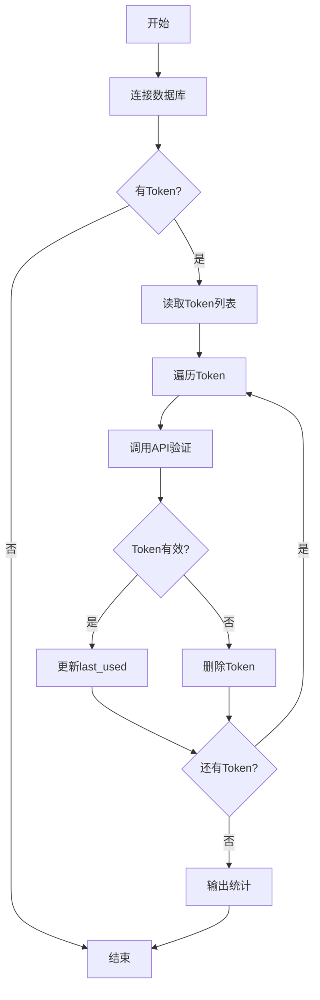

# 报名工具 Token 自动刷新 - 功能总结

## 📋 概述

为了保持报名工具的 Token 活跃状态，防止过期，我们开发了自动刷新功能。

## 🎯 核心功能

### 1. 自动刷新 Token
- 定期调用 `get_enroll_detail` 接口
- 更新 Token 的 `last_used` 时间
- 保持 Token 活跃状态

### 2. 失效检测
- 自动检测失效的 Token
- 从数据库删除失效 Token
- 避免无效数据堆积

### 3. 定期清理
- 清理长期未使用的 Token
- 可自定义清理周期（如 30 天）
- 释放数据库空间

### 4. 完善的日志
- 详细的运行日志
- 成功/失败统计
- 便于排查问题

## 📁 文件列表

```
tools/
├── refresh_baoming_tokens.py   # 主程序（定时刷新脚本）
├── test_refresh.py              # 测试脚本
└── README_refresh.md            # 快速指南

docs/
├── refresh_tokens_deployment.md # 完整部署文档
├── token_refresh_summary.md     # 本文档
├── baoming_token_migration.md   # Token 数据库迁移文档
└── baoming_tool_api.md          # 报名工具 API 文档
```

## 🚀 快速开始

### 测试功能
```bash
# 运行测试脚本
python tools/test_refresh.py
```

### 运行一次
```bash
# 刷新所有 Token
python tools/refresh_baoming_tokens.py

# 只刷新活跃 Token（7天内使用过的）
python tools/refresh_baoming_tokens.py --max-age-days 7
```

### 部署到服务器（Cron）
```bash
# 编辑 crontab
crontab -e

# 添加定时任务（每 6 小时）
0 */6 * * * cd /path/to/project && python tools/refresh_baoming_tokens.py >> /var/log/baoming_refresh.log 2>&1
```

## 🔧 工作原理

```
┌─────────────────┐
│  定时任务触发    │
└────────┬────────┘
         │
         ▼
┌─────────────────┐
│ 从数据库读取    │
│  所有 Token     │
└────────┬────────┘
         │
         ▼
┌─────────────────┐
│  遍历每个 Token │
└────────┬────────┘
         │
         ▼
┌─────────────────────────┐
│ 调用 get_enroll_detail  │
│  接口验证 Token          │
└────────┬────────────────┘
         │
    ┌────┴────┐
    │         │
    ▼         ▼
┌──────┐  ┌──────────┐
│ 有效 │  │  失效    │
└──┬───┘  └────┬─────┘
   │           │
   │           ▼
   │      ┌──────────┐
   │      │ 删除记录 │
   │      └──────────┘
   │
   ▼
┌────────────────┐
│ 更新last_used  │
└────────────────┘
```

## 📊 数据流

### Token 刷新流程



## 🔄 部署方案对比

| 方案 | 优点 | 缺点 | 适用场景 |
|------|------|------|---------|
| **Cron** | 简单可靠，资源占用少 | 配置较繁琐 | ✅ 推荐生产环境 |
| **systemd** | 管理方便，日志完善 | 仅限 Linux | ✅ 企业级部署 |
| **内置定时器** | 配置简单 | 需要持续运行 | ⚠️ 测试环境 |
| **Docker** | 环境隔离，易迁移 | 资源占用较多 | ✅ 容器化部署 |

## 📈 推荐配置

### 生产环境
```cron
# 每 6 小时刷新活跃 Token（推荐）
0 */6 * * * cd /opt/project && python tools/refresh_baoming_tokens.py --max-age-days 7

# 每天凌晨 2 点刷新全部 Token
0 2 * * * cd /opt/project && python tools/refresh_baoming_tokens.py

# 每周日凌晨 3 点清理 30 天未使用的 Token
0 3 * * 0 cd /opt/project && python tools/refresh_baoming_tokens.py --cleanup-days 30
```

### 开发环境
```bash
# 使用内置定时器，每 4 小时刷新一次
python tools/refresh_baoming_tokens.py --scheduler --interval 4 --run-immediately
```

## 🎛️ 参数说明

| 参数 | 说明 | 示例 |
|------|------|------|
| `--scheduler` | 启动内置定时器 | `--scheduler` |
| `--interval N` | 刷新间隔（小时） | `--interval 6` |
| `--run-immediately` | 启动时立即执行 | `--run-immediately` |
| `--max-age-days N` | 只刷新 N 天内使用的 | `--max-age-days 7` |
| `--cleanup-days N` | 清理 N 天未使用的 | `--cleanup-days 30` |
| `--log-file PATH` | 日志文件路径 | `--log-file refresh.log` |
| `--verbose` | 详细输出（调试） | `--verbose` |

## 📝 日志示例

### 成功的日志
```
2024-02-10 15:30:00 [INFO] ============================================================
2024-02-10 15:30:00 [INFO] 🚀 开始刷新报名工具 Token
2024-02-10 15:30:00 [INFO] ============================================================
2024-02-10 15:30:00 [INFO] 📊 找到 5 个 Token 需要刷新
2024-02-10 15:30:00 [INFO] ------------------------------------------------------------
2024-02-10 15:30:00 [INFO] [1/5] 名片: 统一
2024-02-10 15:30:00 [INFO]   用户: 张三
2024-02-10 15:30:00 [INFO]   最后使用: 2024-02-09 10:30:00
2024-02-10 15:30:01 [INFO]   ✅ Token 有效，已更新使用时间
2024-02-10 15:30:05 [INFO] ------------------------------------------------------------
2024-02-10 15:30:05 [INFO] 📊 刷新统计:
2024-02-10 15:30:05 [INFO]   📝 总计: 5 个
2024-02-10 15:30:05 [INFO]   ✅ 成功: 4 个
2024-02-10 15:30:05 [INFO]   ❌ 失败: 0 个
2024-02-10 15:30:05 [INFO]   🗑️ 删除: 1 个
```

### 失败的日志
```
2024-02-10 15:30:02 [INFO] [2/5] 名片: 测试账号
2024-02-10 15:30:02 [INFO]   用户: 李四
2024-02-10 15:30:02 [WARNING]   ⚠️ Token 已失效: invalid access_token
2024-02-10 15:30:02 [INFO]   🗑️ 已删除失效 Token
```

## 🛠️ 维护指南

### 日常检查
```bash
# 查看最新日志
tail -f /var/log/baoming_refresh.log

# 检查是否有错误
grep "ERROR" /var/log/baoming_refresh.log

# 查看统计信息
grep "刷新统计" /var/log/baoming_refresh.log | tail -n 1
```

### 故障排查
```bash
# 测试功能
python tools/test_refresh.py

# 手动运行一次（详细输出）
python tools/refresh_baoming_tokens.py --verbose

# 检查数据库中的 Token
python -c "
from database.models import init_database, BaomingToken
init_database()
print(f'Token 总数: {BaomingToken.objects.count()}')
"
```

### 清理维护
```bash
# 清理 30 天未使用的 Token
python tools/refresh_baoming_tokens.py --cleanup-days 30

# 清理 60 天未使用的 Token
python tools/refresh_baoming_tokens.py --cleanup-days 60
```

## 📚 相关文档

1. **[部署指南](./refresh_tokens_deployment.md)** - 完整的部署步骤和配置
2. **[Token 迁移](./baoming_token_migration.md)** - Token 数据库存储方案
3. **[API 文档](./baoming_tool_api.md)** - 报名工具 API 接口文档
4. **[快速开始](../tools/README_refresh.md)** - 快速使用指南

## ❓ 常见问题

### Q1: 刷新频率设置多少合适？
**A:** 建议每 4-8 小时刷新一次。过于频繁会增加服务器压力，过于稀疏可能导致 Token 过期。

### Q2: 需要刷新所有 Token 吗？
**A:** 不需要。可以使用 `--max-age-days 7` 只刷新最近 7 天使用过的 Token，减少不必要的请求。

### Q3: Token 失效后会怎样？
**A:** 脚本会自动检测并删除失效的 Token。用户下次使用时需要重新登录。

### Q4: 如何监控刷新任务是否正常运行？
**A:** 
- 查看日志文件的最后更新时间
- 检查 Cron 或 systemd 日志
- 使用监控脚本定期检查

### Q5: 可以在 Windows 上部署吗？
**A:** 可以。使用 Windows 任务计划程序代替 Cron，或使用内置定时器模式。

## 🔐 安全建议

1. **日志权限**: 确保日志文件只有管理员可读
2. **定期备份**: 定期备份数据库，包括 Token 数据
3. **监控告警**: 设置失败率告警，及时发现问题
4. **Token 加密**: 考虑对数据库中的 Token 进行加密存储

## 🎯 最佳实践

1. ✅ 使用 Cron 部署到生产环境
2. ✅ 只刷新活跃的 Token（`--max-age-days 7`）
3. ✅ 定期清理过期 Token（每周一次）
4. ✅ 启用日志轮转，避免日志文件过大
5. ✅ 设置监控告警，及时发现异常
6. ✅ 在测试环境先验证功能

## 📊 性能数据

| Token 数量 | 刷新耗时 | 内存占用 | 网络请求 |
|-----------|---------|---------|---------|
| 10 个 | ~15 秒 | ~50 MB | 10 次 |
| 50 个 | ~60 秒 | ~60 MB | 50 次 |
| 100 个 | ~120 秒 | ~70 MB | 100 次 |

*注：每个请求间隔 1 秒，避免请求过快*

## 🔄 更新计划

- [ ] 添加并发刷新支持（可选）
- [ ] 支持 Token 加密存储
- [ ] 添加 Prometheus 监控指标
- [ ] 支持通知渠道（邮件/钉钉/企业微信）
- [ ] 添加 Web 管理界面

## 📞 技术支持

遇到问题？
1. 查看 [部署指南](./refresh_tokens_deployment.md)
2. 运行测试脚本 `python tools/test_refresh.py`
3. 查看日志文件排查问题
4. 联系技术支持

---

**版本**: v1.0.0  
**更新日期**: 2024-02-10  
**作者**: AI Assistant
