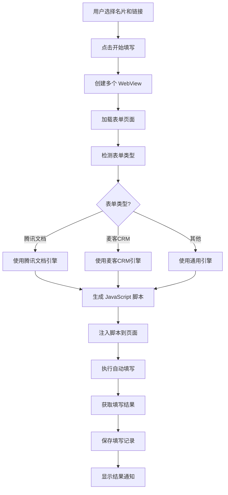

# 🚀 自动表单填写工具 - 项目完整文档

<div align="center">


**基于 Python 的智能表单填写桌面应用**  
自动识别网页表单，一键填写，提升效率 10 倍！

[项目概述](#-项目概述) • [技术架构](#-技术架构) • [功能详解](#-功能详解) • [使用指南](#-使用指南) • [开发文档](#-开发文档)

</div>

---

## 📑 目录

- [项目概述](#-项目概述)
- [核心特性](#-核心特性)
- [技术架构](#-技术架构)
- [项目结构](#-项目结构)
- [功能详解](#-功能详解)
- [数据库设计](#-数据库设计)
- [核心算法](#-核心算法)
- [使用指南](#-使用指南)
- [安装部署](#-安装部署)
- [API 文档](#-api-文档)
- [开发指南](#-开发指南)
- [常见问题](#-常见问题)
- [版本历史](#-版本历史)

---

## 📖 项目概述

### 项目简介

**自动表单填写工具**是一款基于 **Python + PyQt6 + WebEngine** 开发的跨平台桌面应用程序。它能够智能识别网页表单字段，并根据预设的"名片"配置自动填写表单内容，极大地提升表单填写效率。

### 应用场景

- 📝 需要频繁填写相同信息的表单（如用户资料、账号信息等）
- 🔄 批量填写多个表单平台（支持同时填写最多 9 个表单）
- 📊 需要追踪填写记录和统计数据
- 🏢 企业内部表单自动化填写
- 🧪 表单测试和数据录入

### 为什么选择桌面版？

与浏览器插件相比，桌面应用具有以下优势：

| 特性           | 桌面应用               | 浏览器插件              |
| -------------- | ---------------------- | ----------------------- |
| **稳定性**     | ✅ 独立进程，更稳定    | ⚠️ 依赖浏览器           |
| **跨域限制**   | ✅ 无跨域限制          | ❌ 受浏览器安全策略限制 |
| **数据管理**   | ✅ SQLite 数据库       | ⚠️ localStorage         |
| **界面体验**   | ✅ 原生 GUI            | ⚠️ 受限于浏览器         |
| **多平台支持** | ✅ Windows/macOS/Linux | ❌ 每个浏览器都要安装   |
| **数据安全**   | ✅ 本地存储，不上传    | ⚠️ 可能有隐私风险       |

---

## ✨ 核心特性

### 🎯 智能匹配

- **模糊匹配算法**：支持字段名称的智能模糊匹配
- **多种匹配方式**：label、placeholder、name、id 等多种方式
- **中文友好**：优化了中文字段的识别和匹配

### 📇 名片管理

- **可视化管理**：创建、编辑、删除、查看名片
- **配置项动态管理**：支持任意数量的配置项
- **分组和描述**：为名片添加描述信息

### 🔗 链接管理

- **链接分类**：支持链接分类和状态管理
- **多链接填写**：同时填写最多 9 个表单（3x3 网格布局）
- **状态追踪**：激活、归档、已删除状态管理

### 🌐 内嵌浏览器

- **PyQt WebEngine**：完全控制网页行为
- **独立 Profile**：每个表单使用独立的浏览器 Profile（独立 Cookie/Token）
- **实时预览**：可视化查看填写过程

### 📊 记录追踪

- **填写记录**：记录每次填写的时间、结果、成功率
- **统计分析**：名片数、链接数、填写次数、成功率统计
- **历史查询**：查看最近 20 条填写记录

### 🎨 现代 UI

- **macOS Big Sur 风格**：美观的渐变色界面
- **动画效果**：流畅的动画和交互体验
- **响应式布局**：自适应不同屏幕尺寸

### 💾 本地存储

- **SQLite 数据库**：轻量级、高性能
- **数据安全**：所有数据本地存储，不上传云端
- **自动备份**：可手动备份数据库文件

---

## 🏗️ 技术架构

### 技术栈

```
前端界面层
├── PyQt6 6.6.1                 # GUI 框架
├── PyQt6-WebEngine 6.6.0       # Web 浏览器引擎
└── QSS (Qt Style Sheets)       # 样式定制

业务逻辑层
├── Python 3.10+                # 编程语言
├── 自动填写引擎                # JavaScript 注入
├── 字段匹配算法                # 模糊匹配
└── 表单类型检测                # 多平台支持

数据持久层
├── SQLite 3                    # 轻量级数据库
├── Peewee ORM 3.17.0           # 对象关系映射
└── python-dateutil 2.8.2       # 日期处理
```

### 系统架构图

```
┌─────────────────────────────────────────────────────────────┐
│                        用户界面层 (GUI)                      │
├─────────────────────────────────────────────────────────────┤
│  MainWindow      │  CardManager  │  LinkManager  │  AutoFill│
│  (主窗口)        │  (名片管理)   │  (链接管理)   │  (填写窗口)│
└─────────────────────────────────────────────────────────────┘
                              ↓
┌─────────────────────────────────────────────────────────────┐
│                        业务逻辑层 (Core)                     │
├─────────────────────────────────────────────────────────────┤
│  AutoFillEngine  │  TencentDocsFiller  │  FieldMatcher      │
│  (通用引擎)      │  (腾讯文档引擎)     │  (匹配算法)        │
└─────────────────────────────────────────────────────────────┘
                              ↓
┌─────────────────────────────────────────────────────────────┐
│                       数据访问层 (Database)                  │
├─────────────────────────────────────────────────────────────┤
│  DatabaseManager │  Models (Card/CardConfig/Link/Record)    │
└─────────────────────────────────────────────────────────────┘
                              ↓
┌─────────────────────────────────────────────────────────────┐
│                      数据存储层 (SQLite)                     │
├─────────────────────────────────────────────────────────────┤
│  cards  │  card_configs  │  links  │  fill_records          │
└─────────────────────────────────────────────────────────────┘
```

### 核心模块说明

#### 1. GUI 层 (`gui/`)

负责用户界面和交互逻辑。

- **MainWindow**: 主窗口，显示统计信息、功能导航、填写记录
- **CardManagerDialog**: 名片管理对话框，CRUD 操作
- **LinkManagerDialog**: 链接管理对话框，CRUD 操作
- **AutoFillWindow**: 自动填写窗口，包含 WebView 和填写逻辑

#### 2. Core 层 (`core/`)

核心业务逻辑。

- **AutoFillEngine**: 通用自动填写引擎（麦客 CRM、通用 HTML 表单）
- **AutoFillEngineV2**: 优化版填写引擎
- **TencentDocsFiller**: 腾讯文档专用填写引擎
- **FieldMatcher**: 字段匹配算法（模糊匹配、相似度计算）
- **PageDiagnostic**: 页面诊断工具

#### 3. Database 层 (`database/`)

数据访问和管理。

- **models.py**: 数据模型定义（Card、CardConfig、Link、FillRecord）
- **db_manager.py**: 数据库管理器，提供高级操作接口

---

## 📂 项目结构

```
auto-form-filler-py/
│
├── 📄 main.py                      # 程序入口
├── 📄 config.py                    # 全局配置
├── 📄 requirements.txt             # Python 依赖
│
├── 📁 database/                    # 数据库模块
│   ├── __init__.py
│   ├── models.py                  # 数据模型 (Card/CardConfig/Link/FillRecord)
│   └── db_manager.py              # 数据管理器 (CRUD 操作)
│
├── 📁 core/                        # 核心功能
│   ├── __init__.py
│   ├── auto_fill.py               # 通用自动填写引擎
│   ├── auto_fill_v2.py            # 麦客CRM填写引擎
│   ├── tencent_docs_filler.py     # 腾讯文档填写引擎 🆕
│   ├── matcher.py                 # 字段匹配算法
│   └── diagnostic.py              # 页面诊断工具
│
├── 📁 gui/                         # GUI 界面
│   ├── __init__.py
│   ├── main_window.py             # 主窗口
│   ├── card_manager.py            # 名片管理
│   ├── link_manager.py            # 链接管理
│   ├── auto_fill_window.py        # 自动填写窗口
│   └── styles.py                  # 样式定义
│
├── 📁 data/                        # 数据目录 (自动创建)
│   └── auto_form_filler.db        # SQLite 数据库
│
├── 📁 dist/                        # 打包后的可执行文件
├── 📁 build/                       # 构建临时文件
│
├── 📄 README.md                    # 项目说明
├── 📄 QUICKSTART.md                # 快速入门
├── 📄 TENCENT_DOCS_SUPPORT.md      # 腾讯文档支持文档
├── 📄 FEATURE_SUMMARY.md           # 功能总结
├── 📄 CHANGELOG.md                 # 更新日志
├── 📄 BUILD_GUIDE.md               # 构建指南
├── 📄 CROSS_PLATFORM_BUILD.md      # 跨平台构建
│
├── 📄 install.sh                   # 安装脚本 (macOS/Linux)
├── 📄 run.sh                       # 运行脚本 (macOS/Linux)
├── 📄 build.py                     # 打包脚本
├── 📄 build_windows.bat            # Windows 打包脚本
└── 📄 自动表单填写工具.spec         # PyInstaller 配置
```

### 文件说明

| 文件                          | 说明                             | 行数  |
| ----------------------------- | -------------------------------- | ----- |
| `main.py`                     | 程序入口，初始化数据库和主窗口   | ~40   |
| `config.py`                   | 全局配置（窗口大小、延迟时间等） | ~30   |
| `database/models.py`          | 数据模型（4 个表）               | ~210  |
| `database/db_manager.py`      | 数据管理器（CRUD 操作）          | ~195  |
| `core/auto_fill.py`           | 通用填写引擎（生成 JS 脚本）     | ~300  |
| `core/tencent_docs_filler.py` | 腾讯文档引擎                     | ~340  |
| `core/matcher.py`             | 字段匹配算法                     | ~80   |
| `gui/main_window.py`          | 主窗口（统计、导航、记录）       | ~350  |
| `gui/auto_fill_window.py`     | 自动填写窗口（WebView、多链接）  | ~1080 |
| `gui/card_manager.py`         | 名片管理界面                     | ~400+ |
| `gui/link_manager.py`         | 链接管理界面                     | ~400+ |

---

## 🎯 功能详解

### 1. 名片管理

名片是预设的填写配置模板，包含多个字段-值对。

#### 功能列表

- ✅ **新增名片**：创建新的填写配置
- ✅ **编辑名片**：修改名片名称、描述和配置项
- ✅ **查看名片**：查看名片的所有配置项
- ✅ **删除名片**：删除不需要的名片（级联删除关联数据）
- ✅ **配置项管理**：动态添加/删除配置项

#### 名片数据结构

```python
Card {
    id: int                    # 主键
    name: str                  # 名片名称
    description: str           # 描述
    created_at: datetime       # 创建时间
    updated_at: datetime       # 更新时间
    configs: List[CardConfig]  # 配置项列表
}

CardConfig {
    id: int           # 主键
    card_id: int      # 关联名片ID
    key: str          # 字段名
    value: str        # 字段值
    order: int        # 排序
}
```

#### 使用示例

创建一个名为"测试账号"的名片：

```
名片名称: 测试账号
描述: 用于测试表单填写

配置项:
┌──────────────┬───────────────────┐
│   字段名     │      字段值       │
├──────────────┼───────────────────┤
│ 手机号       │ 13800138000       │
│ 微信         │ weixin123         │
│ 抖音昵称     │ 测试用户          │
│ 抖音账号     │ test_user_001     │
│ 粉丝数量     │ 10000             │
│ 主页链接     │ https://...       │
│ 赞藏量       │ 5000              │
│ 所在地       │ 北京              │
│ 报价         │ 300               │
│ 账号类型     │ 母婴              │
└──────────────┴───────────────────┘
```

### 2. 链接管理

管理需要填写的表单链接。

#### 功能列表

- ✅ **新增链接**：添加新的表单链接
- ✅ **编辑链接**：修改链接信息
- ✅ **复制链接**：快速复制 URL
- ✅ **删除链接**：删除不需要的链接
- ✅ **状态管理**：激活/归档/删除状态
- ✅ **分类管理**：为链接添加分类标签

#### 链接数据结构

```python
Link {
    id: int               # 主键
    name: str             # 链接名称
    url: str              # 链接地址
    status: str           # 状态 (active/archived/deleted)
    category: str         # 分类
    description: str      # 描述
    created_at: datetime  # 创建时间
    updated_at: datetime  # 更新时间
}
```

#### 支持的表单平台

| 平台           | 识别规则           | 引擎              | 状态      |
| -------------- | ------------------ | ----------------- | --------- |
| 腾讯文档表单   | `docs.qq.com/form` | TencentDocsFiller | ✅ 已支持 |
| 麦客 CRM 表单  | `mikecrm.com`      | AutoFillEngineV2  | ✅ 已支持 |
| 通用 HTML 表单 | 其他               | AutoFillEngine    | ✅ 已支持 |

### 3. 自动填写

核心功能，将名片配置自动填写到表单中。

#### 功能特性

- ✅ **多链接同时填写**：支持同时填写最多 9 个表单（3x3 网格布局）
- ✅ **独立浏览器实例**：每个表单使用独立的 Profile（独立 Cookie/Token）
- ✅ **智能表单检测**：自动检测表单类型（腾讯文档/麦客 CRM/通用）
- ✅ **实时状态显示**：显示每个表单的加载和填写状态
- ✅ **配置面板**：实时查看当前使用的名片配置
- ✅ **填写结果反馈**：详细显示每个字段的填写情况

#### 填写流程



#### 使用步骤

1. **选择名片**：在左侧名片列表中选择一个名片
2. **选择链接**：勾选要填写的链接（最多 9 个）
3. **开始填写**：点击"开始填写"按钮
4. **等待加载**：等待所有表单页面加载完成
5. **自动填写**：系统自动填写所有表单
6. **查看结果**：查看每个表单的填写状态和结果

#### 网格布局规则

| 链接数量 | 网格布局 |
| -------- | -------- |
| 1 个     | 1x1      |
| 2 个     | 1x2      |
| 3-4 个   | 2x2      |
| 5-6 个   | 2x3      |
| 7-9 个   | 3x3      |

### 4. 填写记录

自动记录每次填写的详细信息。

#### 记录内容

```python
FillRecord {
    id: int               # 主键
    card_id: int          # 使用的名片ID
    link_id: int          # 填写的链接ID
    fill_count: int       # 成功填写的字段数
    total_count: int      # 总配置项数
    success: bool         # 是否成功
    error_message: str    # 错误信息（如有）
    created_at: datetime  # 填写时间
}
```

#### 统计指标

- 📊 **名片总数**：系统中的名片数量
- 🔗 **链接总数**：系统中的链接数量
- 📝 **填写记录**：总填写次数
- ✅ **成功次数**：成功填写的次数
- 📈 **成功率**：成功次数 / 总次数

### 5. 诊断工具

帮助用户调试表单填写问题。

#### 功能

- 🔍 **表单结构分析**：显示表单中的所有字段
- 📋 **问题标题提取**：提取腾讯文档表单的问题标题
- 🏷️ **字段属性查看**：查看字段的 label、placeholder、name、id 等
- 🔧 **匹配建议**：根据诊断结果提供字段匹配建议

---

## 💾 数据库设计

### ER 图

```
┌─────────────────┐         ┌──────────────────┐
│     Card        │         │   CardConfig     │
├─────────────────┤         ├──────────────────┤
│ id (PK)         │◄───────►│ id (PK)          │
│ name            │   1:N   │ card_id (FK)     │
│ description     │         │ key              │
│ created_at      │         │ value            │
│ updated_at      │         │ order            │
└─────────────────┘         └──────────────────┘
        │
        │ 1:N
        ▼
┌─────────────────┐         ┌──────────────────┐
│  FillRecord     │         │      Link        │
├─────────────────┤         ├──────────────────┤
│ id (PK)         │         │ id (PK)          │
│ card_id (FK)    │◄───────►│ name             │
│ link_id (FK)    │   N:1   │ url              │
│ fill_count      │         │ status           │
│ total_count     │         │ category         │
│ success         │         │ description      │
│ error_message   │         │ created_at       │
│ created_at      │         │ updated_at       │
└─────────────────┘         └──────────────────┘
```

### 表结构详解

#### 1. cards 表（名片）

| 字段        | 类型         | 说明     | 约束        |
| ----------- | ------------ | -------- | ----------- |
| id          | INTEGER      | 主键     | PRIMARY KEY |
| name        | VARCHAR(100) | 名片名称 | NOT NULL    |
| description | TEXT         | 描述     | NULL        |
| created_at  | DATETIME     | 创建时间 | DEFAULT NOW |
| updated_at  | DATETIME     | 更新时间 | DEFAULT NOW |

#### 2. card_configs 表（名片配置项）

| 字段    | 类型         | 说明        | 约束                 |
| ------- | ------------ | ----------- | -------------------- |
| id      | INTEGER      | 主键        | PRIMARY KEY          |
| card_id | INTEGER      | 关联名片 ID | FOREIGN KEY, CASCADE |
| key     | VARCHAR(100) | 字段名      | NOT NULL             |
| value   | TEXT         | 字段值      | NOT NULL             |
| order   | INTEGER      | 排序        | DEFAULT 0            |

**索引**: `(card_id, order)`

#### 3. links 表（链接）

| 字段        | 类型         | 说明     | 约束             |
| ----------- | ------------ | -------- | ---------------- |
| id          | INTEGER      | 主键     | PRIMARY KEY      |
| name        | VARCHAR(200) | 链接名称 | NOT NULL         |
| url         | TEXT         | 链接地址 | NOT NULL         |
| status      | VARCHAR(50)  | 状态     | DEFAULT 'active' |
| category    | VARCHAR(100) | 分类     | NULL             |
| description | TEXT         | 描述     | NULL             |
| created_at  | DATETIME     | 创建时间 | DEFAULT NOW      |
| updated_at  | DATETIME     | 更新时间 | DEFAULT NOW      |

**状态枚举**: `active`, `archived`, `deleted`

#### 4. fill_records 表（填写记录）

| 字段          | 类型     | 说明           | 约束                 |
| ------------- | -------- | -------------- | -------------------- |
| id            | INTEGER  | 主键           | PRIMARY KEY          |
| card_id       | INTEGER  | 使用的名片 ID  | FOREIGN KEY, CASCADE |
| link_id       | INTEGER  | 填写的链接 ID  | FOREIGN KEY, CASCADE |
| fill_count    | INTEGER  | 成功填写字段数 | DEFAULT 0            |
| total_count   | INTEGER  | 总配置项数     | DEFAULT 0            |
| success       | BOOLEAN  | 是否成功       | DEFAULT TRUE         |
| error_message | TEXT     | 错误信息       | NULL                 |
| created_at    | DATETIME | 填写时间       | DEFAULT NOW          |

**索引**: `(created_at)`

---

## 🧮 核心算法

### 1. 字段匹配算法

位于 `core/matcher.py`，实现智能模糊匹配。

#### 算法流程

```python
def match_keyword(text, keyword):
    """
    模糊匹配算法

    1. 文本清理
       - 转小写
       - 移除标点符号（：:*？?！!。.、，,）
       - 移除空格

    2. 双向包含匹配
       - keyword in text
       - text in keyword

    3. 返回匹配结果
    """
    clean_text = clean_text(text)
    clean_keyword = clean_text(keyword)

    return (clean_keyword in clean_text) or (clean_text in clean_keyword)
```

#### 匹配示例

| 字段名称（页面）     | 配置名称（名片） | 清理后                     | 匹配结果 |
| -------------------- | ---------------- | -------------------------- | -------- |
| 手机号【着急时联系】 | 手机号           | 手机号着急时联系 vs 手机号 | ✅ 匹配  |
| 微信号码             | 微信             | 微信号码 vs 微信           | ✅ 匹配  |
| 抖音昵称             | 昵称             | 抖音昵称 vs 昵称           | ✅ 匹配  |
| Email Address        | email            | emailaddress vs email      | ✅ 匹配  |
| 姓名                 | 用户姓名         | 姓名 vs 用户姓名           | ✅ 匹配  |

#### 相似度计算

```python
def calculate_similarity(text1, text2):
    """
    计算两个文本的相似度

    返回值: 0.0 - 1.0

    算法:
    1. 完全相同 → 1.0
    2. 包含关系 → len(短) / len(长)
    3. 字符交集 → len(交集) / len(并集)
    """
    if text1 == text2:
        return 1.0

    if text1 in text2:
        return len(text1) / len(text2)

    common_chars = set(text1) & set(text2)
    total_chars = set(text1) | set(text2)

    return len(common_chars) / len(total_chars)
```

### 2. 表单类型检测

位于 `gui/auto_fill_window.py`。

```python
def detect_form_type(url: str) -> str:
    """
    检测表单类型

    参数:
        url: 表单 URL

    返回:
        'tencent_docs': 腾讯文档表单
        'mikecrm': 麦客CRM表单
        'unknown': 未知类型
    """
    if 'docs.qq.com/form' in url:
        return 'tencent_docs'
    elif 'mikecrm.com' in url:
        return 'mikecrm'
    else:
        return 'unknown'
```

### 3. JavaScript 注入原理

#### 通用填写引擎

```javascript
(function () {
  // 1. 查找所有输入框
  const inputs = document.querySelectorAll("input, textarea, select");

  // 2. 遍历配置项
  fillData.forEach((item) => {
    // 3. 查找匹配的字段
    inputs.forEach((input) => {
      const label = findLabel(input);
      const placeholder = input.placeholder;
      const name = input.name;
      const id = input.id;

      // 4. 模糊匹配
      if (
        matchKeyword(label, item.key) ||
        matchKeyword(placeholder, item.key) ||
        matchKeyword(name, item.key) ||
        matchKeyword(id, item.key)
      ) {
        // 5. 填写值
        input.value = item.value;

        // 6. 触发事件
        input.dispatchEvent(new Event("input", { bubbles: true }));
        input.dispatchEvent(new Event("change", { bubbles: true }));
        input.dispatchEvent(new Event("blur", { bubbles: true }));
      }
    });
  });

  // 7. 返回结果
  return { fillCount, totalCount, success, results };
})();
```

#### 腾讯文档专用引擎

```javascript
(async function () {
  // 1. 等待页面加载
  await waitForPageReady();

  // 2. 查找所有问题
  const questions = document.querySelectorAll(".question[data-qid]");

  // 3. 遍历每个问题
  for (let question of questions) {
    // 4. 提取问题标题
    const title = getQuestionTitle(question);

    // 5. 查找匹配的配置
    const matchedValue = findMatchedValue(title, fillData);

    // 6. 获取输入框
    const input = getInputElement(question);

    // 7. 移除 disabled 属性
    input.removeAttribute("disabled");

    // 8. 填写值
    input.value = matchedValue;

    // 9. 触发事件
    input.dispatchEvent(new Event("input", { bubbles: true }));
    input.dispatchEvent(new Event("change", { bubbles: true }));
    input.dispatchEvent(new Event("blur", { bubbles: true }));
  }

  // 10. 存储结果
  window.__autoFillResult__ = { status, message, filled, failed };
})();
```

---

## 📚 使用指南

### 快速开始

#### 1. 首次启动

```bash
# 进入项目目录
cd /Users/chenchen/Desktop/开发项目/auto-form-filler-py

# 运行程序
./run.sh
```

程序会自动：

- 创建 SQLite 数据库
- 生成默认测试数据（1 个名片 + 2 个链接）

#### 2. 创建名片

**步骤：**

1. 点击主界面的"📇 名片管理"
2. 点击"➕ 新增名片"
3. 填写名片信息：
   - 名片名称：例如"测试账号 1"
   - 描述：例如"用于测试表单填写"
4. 添加配置项：
   - 点击"➕ 添加配置项"
   - 填写字段名和字段值
   - 例如：手机号 → 13800138000
5. 点击"保存"

**最佳实践：**

- 字段名要与表单中的字段名称相近或包含关系
- 使用简短的字段名（如"微信"而不是"微信号码"）
- 避免使用特殊字符

#### 3. 添加链接

**步骤：**

1. 点击主界面的"🔗 链接管理"
2. 点击"➕ 新增链接"
3. 填写链接信息：
   - 链接名称：例如"抖音招募表单"
   - 链接 URL：完整的表单地址
   - 状态：选择"激活"
   - 分类：例如"腾讯文档"或"麦客 CRM"
4. 点击"保存"

#### 4. 自动填写

**步骤：**

1. 点击主界面的"📝 自动填写"
2. 在左侧选择一个名片
3. 勾选要填写的链接（最多 9 个）
4. 点击"✏️ 开始填写"
5. 等待页面加载和自动填写完成
6. 查看填写结果

**注意事项：**

- 确保网络连接正常
- 部分表单可能需要登录后才能填写
- 如果填写失败，使用"🔍 诊断页面"查看表单结构

### 高级功能

#### 1. 配置面板

在自动填写页面点击"📋 配置面板"可以：

- 查看当前名片的所有配置项
- 实时参考配置进行手动填写

#### 2. 诊断页面

点击"🔍 诊断页面"可以：

- 查看表单的所有字段和属性
- 获取字段的精确名称
- 根据诊断结果调整名片配置

#### 3. 多链接填写

支持同时填写最多 9 个表单：

- 每个表单使用独立的浏览器 Profile
- 独立的 Cookie 和 Token
- 互不干扰

#### 4. 填写记录

主界面底部显示最近 20 条填写记录：

- 填写时间
- 使用的名片和链接
- 成功填写的字段数
- 填写状态（成功/失败）

---

## 🛠️ 安装部署

### 环境要求

- **操作系统**：macOS、Windows、Linux
- **Python 版本**：3.10 或更高
- **pip**：最新版本

### 方式一：快速安装（macOS/Linux）

```bash
# 1. 克隆或下载项目
cd ~/Desktop/开发项目/auto-form-filler-py

# 2. 运行安装脚本
./install.sh

# 3. 启动程序
./run.sh
```

### 方式二：手动安装

#### macOS/Linux

```bash
# 1. 进入项目目录
cd /path/to/auto-form-filler-py

# 2. 创建虚拟环境
python3 -m venv venv

# 3. 激活虚拟环境
source venv/bin/activate

# 4. 升级 pip
pip install --upgrade pip

# 5. 安装依赖
pip install -r requirements.txt

# 6. 运行程序
python main.py
```

#### Windows

```powershell
# 1. 进入项目目录
cd C:\path\to\auto-form-filler-py

# 2. 创建虚拟环境
python -m venv venv

# 3. 激活虚拟环境
venv\Scripts\activate

# 4. 升级 pip
python -m pip install --upgrade pip

# 5. 安装依赖
pip install -r requirements.txt

# 6. 运行程序
python main.py
```

### 方式三：打包成可执行文件

#### macOS

```bash
# 使用 PyInstaller 打包
python build.py

# 可执行文件位置
dist/自动表单填写工具.app
```

#### Windows

```batch
# 使用 PyInstaller 打包
build_windows.bat

# 可执行文件位置
dist\自动表单填写工具\自动表单填写工具.exe
```

### 依赖说明

```
PyQt6==6.6.1                # GUI 框架
PyQt6-WebEngine==6.6.0      # Web 浏览器引擎
peewee==3.17.0              # ORM 框架
python-dateutil==2.8.2      # 日期工具
```

---

## 📖 API 文档

### DatabaseManager

数据库管理器，提供高级数据操作接口。

#### 名片相关

```python
# 获取所有名片
cards = DatabaseManager.get_all_cards()

# 根据ID获取名片
card = DatabaseManager.get_card_by_id(card_id)

# 创建名片
card = DatabaseManager.create_card(
    name="名片1",
    configs=[
        {'key': '手机号', 'value': '13800138000'},
        {'key': '微信', 'value': 'weixin123'}
    ],
    description="测试名片"
)

# 更新名片
success = DatabaseManager.update_card(
    card_id=1,
    name="新名称",
    configs=[...],
    description="新描述"
)

# 删除名片
success = DatabaseManager.delete_card(card_id)
```

#### 链接相关

```python
# 获取所有链接
links = DatabaseManager.get_all_links()

# 获取指定状态的链接
active_links = DatabaseManager.get_all_links(status='active')

# 根据ID获取链接
link = DatabaseManager.get_link_by_id(link_id)

# 创建链接
link = DatabaseManager.create_link(
    name="测试链接",
    url="https://example.com",
    status="active",
    category="测试",
    description="测试链接"
)

# 更新链接
success = DatabaseManager.update_link(
    link_id=1,
    name="新名称",
    url="https://new-url.com"
)

# 删除链接
success = DatabaseManager.delete_link(link_id)
```

#### 填写记录相关

```python
# 创建填写记录
record = DatabaseManager.create_fill_record(
    card_id=1,
    link_id=1,
    fill_count=8,
    total_count=10,
    success=True
)

# 获取填写记录
records = DatabaseManager.get_fill_records(
    card_id=1,      # 可选，筛选名片
    link_id=1,      # 可选，筛选链接
    limit=100       # 限制数量
)

# 获取统计信息
stats = DatabaseManager.get_statistics()
# {
#     'total_cards': 4,
#     'total_links': 3,
#     'total_records': 12,
#     'success_records': 10,
#     'active_links': 2
# }
```

### AutoFillEngine

通用自动填写引擎。

```python
from core import AutoFillEngine

engine = AutoFillEngine()

# 生成填写脚本
fill_data = [
    {'key': '手机号', 'value': '13800138000'},
    {'key': '微信', 'value': 'weixin123'}
]
js_code = engine.generate_fill_script(fill_data)

# 生成通知脚本
notification_js = engine.generate_notification_script(
    fill_count=8,
    total_count=10
)

# 生成获取结果的脚本
get_result_js = engine.generate_get_result_script()
```

### TencentDocsFiller

腾讯文档专用填写引擎。

```python
from core import TencentDocsFiller

engine = TencentDocsFiller()

# 生成填写脚本（使用字典格式）
field_data = {
    '手机号【着急时联系】': '13800138000',
    '微信': 'weixin123',
    '抖音昵称': '测试账号'
}
js_code = engine.generate_fill_script(field_data)

# 生成获取结果的脚本
get_result_js = engine.generate_get_result_script()

# 生成诊断脚本
diagnostic_js = engine.generate_diagnostic_script()
```

### FieldMatcher

字段匹配算法。

```python
from core import FieldMatcher

matcher = FieldMatcher()

# 清理文本
clean = matcher.clean_text("手机号【着急时联系】")  # "手机号着急时联系"

# 关键词匹配
matched = matcher.match_keyword("手机号【着急时联系】", "手机号")  # True

# 计算相似度
similarity = matcher.calculate_similarity("手机号", "手机号码")  # 0.75
```

---

## 🔧 开发指南

### 项目规范

#### 代码风格

- 遵循 PEP 8 规范
- 使用 4 空格缩进
- 类名使用 PascalCase
- 函数名使用 snake_case
- 常量使用 UPPER_CASE

#### 注释规范

```python
def function_name(param1: str, param2: int) -> bool:
    """
    函数说明（一句话）

    详细说明（可选）

    Args:
        param1: 参数1说明
        param2: 参数2说明

    Returns:
        返回值说明

    Raises:
        异常说明（可选）
    """
    pass
```

### 添加新功能

#### 1. 添加新的表单平台支持

**步骤：**

1. 在 `core/` 目录创建新的填写引擎文件
2. 实现 `generate_fill_script()` 方法
3. 在 `gui/auto_fill_window.py` 中添加检测规则
4. 更新 `core/__init__.py` 导出新引擎
5. 编写测试和文档

**示例：**

```python
# core/new_platform_filler.py

class NewPlatformFiller:
    """新平台填写引擎"""

    def generate_fill_script(self, field_data):
        """生成填写脚本"""
        # 实现填写逻辑
        pass

    def generate_get_result_script(self):
        """生成获取结果的脚本"""
        pass
```

```python
# gui/auto_fill_window.py

def detect_form_type(self, url: str) -> str:
    """检测表单类型"""
    if 'newplatform.com' in url:
        return 'new_platform'
    # ...
```

#### 2. 添加新的 GUI 功能

**步骤：**

1. 在 `gui/` 目录创建新的窗口/对话框文件
2. 继承 `QWidget` 或 `QDialog`
3. 实现 `init_ui()` 方法
4. 在主窗口添加入口
5. 更新导航按钮

### 调试技巧

#### 1. 启用调试模式

```python
# config.py
DEBUG = True
```

#### 2. 查看 JavaScript 控制台输出

```python
class WebEnginePage(QWebEnginePage):
    def javaScriptConsoleMessage(self, level, message, lineNumber, sourceID):
        print(f"JS ({level}): {message}")
```

#### 3. 数据库查询

```python
# 使用 Peewee 查询
from database.models import Card, CardConfig

# 查询所有名片
cards = Card.select()

# 查询指定名片的配置项
configs = CardConfig.select().where(CardConfig.card == card)
```

### 测试

#### 单元测试

```python
import unittest
from core import FieldMatcher

class TestFieldMatcher(unittest.TestCase):
    def test_clean_text(self):
        matcher = FieldMatcher()
        result = matcher.clean_text("手机号【着急时联系】")
        self.assertEqual(result, "手机号着急时联系")

    def test_match_keyword(self):
        matcher = FieldMatcher()
        result = matcher.match_keyword("手机号【着急时联系】", "手机号")
        self.assertTrue(result)

if __name__ == '__main__':
    unittest.main()
```

#### 集成测试

```python
from database import DatabaseManager

# 测试数据库操作
db = DatabaseManager()

# 创建测试名片
card = db.create_card(
    name="测试名片",
    configs=[{'key': '测试字段', 'value': '测试值'}]
)

# 验证
assert card.id is not None
assert card.name == "测试名片"
assert len(card.configs) == 1
```

---

## ❓ 常见问题

### Q1: 安装依赖失败？

**A:** 可能是 pip 版本过旧或网络问题

```bash
# 升级 pip
pip install --upgrade pip

# 使用国内镜像
pip install -r requirements.txt -i https://pypi.tuna.tsinghua.edu.cn/simple
```

### Q2: 程序无法启动？

**A:** 检查 Python 版本

```bash
python --version  # 应该是 3.10 或更高
```

**A:** 检查依赖是否安装完整

```bash
pip list
# 确认 PyQt6、PyQt6-WebEngine、peewee 已安装
```

### Q3: 自动填写没有效果？

**A:** 可能的原因：

1. **字段名称匹配不准确**

   - 使用"诊断页面"查看表单字段
   - 调整名片配置的字段名

2. **页面加载未完成**

   - 增加 `config.py` 中的 `AUTO_FILL_DELAY`
   - 默认是 1000 毫秒，可以改为 2000

3. **表单需要登录**

   - 在 WebView 中先手动登录
   - 登录后再执行自动填写

4. **特殊表单控件**
   - 某些特殊控件可能不支持
   - 需要手动填写

### Q4: 如何备份数据？

**A:** 直接复制数据库文件

```bash
# macOS/Linux
cp data/auto_form_filler.db data/backup_$(date +%Y%m%d).db

# Windows
copy data\auto_form_filler.db data\backup_%date:~0,4%%date:~5,2%%date:~8,2%.db
```

### Q5: 支持哪些平台？

**A:**

- ✅ macOS (Intel 和 Apple Silicon)
- ✅ Windows 10/11
- ✅ Linux (Ubuntu 20.04+, Debian, Fedora 等)

### Q6: 如何使用腾讯文档表单填写？

**A:**

1. 添加腾讯文档表单链接（包含 `docs.qq.com/form`）
2. 配置名片字段，**字段名要与表单问题标题匹配**
3. 使用"🔍 诊断页面"查看表单问题标题
4. 根据诊断结果调整名片配置

详细说明请查看 [TENCENT_DOCS_SUPPORT.md](TENCENT_DOCS_SUPPORT.md)

### Q7: 腾讯文档表单填写失败怎么办？

**A:** 排查步骤：

```bash
1. 点击"🔍 诊断页面"按钮
2. 查看控制台输出
3. 对比问题标题和名片字段名
4. 调整名片配置后重试
```

可能的原因：

- **字段名不匹配** → 使用诊断功能查看准确的问题标题
- **需要登录** → 部分表单需要登录腾讯账号后才能填写
- **页面未加载完成** → 增加 `config.py` 中的 `AUTO_FILL_DELAY`

### Q8: 能否同时填写多个表单？

**A:** 可以！支持同时填写最多 9 个表单。

- 每个表单使用独立的浏览器 Profile
- 独立的 Cookie、Token、缓存
- 互不干扰

### Q9: 数据安全吗？

**A:** 非常安全！

- ✅ 所有数据本地存储（SQLite）
- ✅ 不上传任何信息到云端
- ✅ 独立的浏览器 Profile（每个表单隔离）
- ✅ 开源代码，可审查

### Q10: 如何更新程序？

**A:**

```bash
# 1. 备份数据库
cp data/auto_form_filler.db data/backup.db

# 2. 拉取最新代码
git pull

# 3. 更新依赖
pip install -r requirements.txt --upgrade

# 4. 运行程序
python main.py
```

---

## 📝 版本历史

### v1.1.0 (2025-10-21)

**新增功能：**

- ✅ 腾讯文档表单支持（`TencentDocsFiller`）
- ✅ 多链接同时填写（最多 9 个）
- ✅ 独立浏览器 Profile（每个表单独立 Cookie/Token）
- ✅ 动画消息框
- ✅ 诊断工具

**优化改进：**

- 🔧 界面优化（macOS Big Sur 风格）
- 🔧 网格布局支持
- 🔧 实时状态显示

**文档更新：**

- 📚 TENCENT_DOCS_SUPPORT.md
- 📚 CHANGELOG.md
- 📚 FEATURE_SUMMARY.md

### v1.0.0 (2025-10-09)

**初始版本：**

- ✅ 名片管理
- ✅ 链接管理
- ✅ 自动填写（麦客 CRM、通用 HTML 表单）
- ✅ 填写记录
- ✅ 统计功能
- ✅ 现代化 GUI

---

## 📄 许可证

MIT License

Copyright (c) 2025 Auto Form Filler

Permission is hereby granted, free of charge, to any person obtaining a copy
of this software and associated documentation files (the "Software"), to deal
in the Software without restriction, including without limitation the rights
to use, copy, modify, merge, publish, distribute, sublicense, and/or sell
copies of the Software, and to permit persons to whom the Software is
furnished to do so, subject to the following conditions:

The above copyright notice and this permission notice shall be included in all
copies or substantial portions of the Software.

THE SOFTWARE IS PROVIDED "AS IS", WITHOUT WARRANTY OF ANY KIND, EXPRESS OR
IMPLIED, INCLUDING BUT NOT LIMITED TO THE WARRANTIES OF MERCHANTABILITY,
FITNESS FOR A PARTICULAR PURPOSE AND NONINFRINGEMENT. IN NO EVENT SHALL THE
AUTHORS OR COPYRIGHT HOLDERS BE LIABLE FOR ANY CLAIM, DAMAGES OR OTHER
LIABILITY, WHETHER IN AN ACTION OF CONTRACT, TORT OR OTHERWISE, ARISING FROM,
OUT OF OR IN CONNECTION WITH THE SOFTWARE OR THE USE OR OTHER DEALINGS IN THE
SOFTWARE.

---

## 📮 联系方式

- **GitHub Issues**: [提交问题](https://github.com/yourusername/auto-form-filler-py/issues)
- **Email**: your-email@example.com

---

## 🙏 致谢

- [PyQt6](https://www.riverbankcomputing.com/software/pyqt/) - 强大的 GUI 框架
- [Peewee](http://docs.peewee-orm.com/) - 简洁的 ORM 框架
- [SQLite](https://www.sqlite.org/) - 轻量级数据库
- 所有贡献者和用户的支持

---

<div align="center">

**⭐ 如果这个项目对您有帮助，请给个 Star！**

Made with ❤️ by Auto Form Filler Team

</div>
